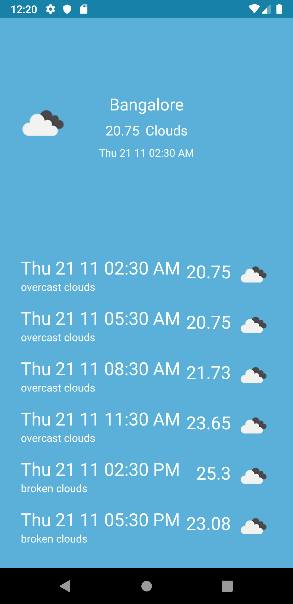
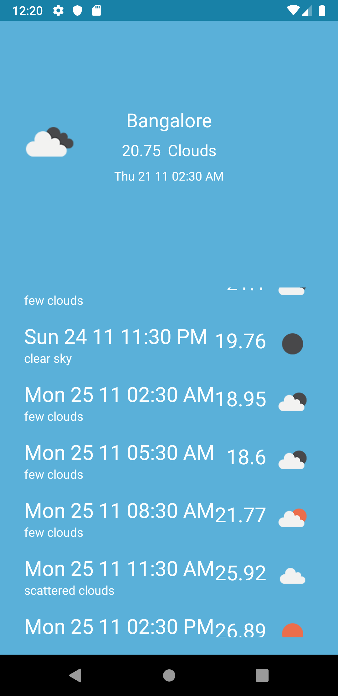

# Weatherly
Weatherly is a sample project to try out mvvm pattern, livedata, room and work manager.

Weatherly is an android app which would pull weather forecast from http://openweathermap.org/API.

  

Architecture followed is as follows:

**Worker and WorkManager**
  * Application has a LoadWeatherWorker which is loaded by a periodicWorkRequest enqueued to run between 2 hours - 2.30 hours when constraint Unmetered network is available. 
  * LoadWeatherWorker check for the latest location using FusedLocationProviderClient. 
  * Upon getting latest location it will use Retrofit to load data from API providing location and APIKEY. APIKEY is added to the request from Interceptor. 
  * When response is received from server, worker will call repository to save the data to Room Database. We will run a transaction which will delete earlier data from db and insert new Forecast data. 
  * We will observe the response of db operation and if we get a success from repository, we would set Result.Success to SettableFuture. When startWork receives Success in mFuture worker will be considered successful and won't try for retry. If any step fails, we will pass Result.failure and worker will be retried after specified time.

**MVVM and Livedata**
  * MainActivity would be observing the changes in WeatherViewModel which holds the Livedata for forecast. 
  * On change in location in Viewmodel which in turn will keep listening to Repository's LiveData for forecast. 
  * Repository will be observing Dao to get update in forecast_response and will pass result as Livedata. 
  * We are displaying the response using databinding in recyclerview and other UI controls.
  * Dependency is provided by Dagger2.
  

TODO:

  * JUnit tests
  * Better Error handling 
  * UI Fixes: Group forecast data according to date rather than simple 3 hour data list. Each item can be clickable to view details in a horizontal list or so. 
  
